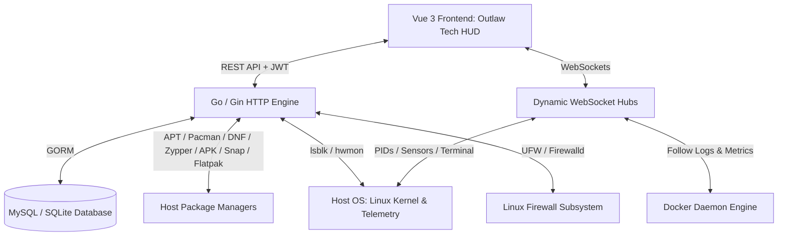

# Blackwater Server Manager

<p align="center">
  
</p>

<p align="center">
  <strong>Robust, High-Performance Linux Server Infrastructure & Telemetry Engine</strong><br>
  <em>Forged with Go, Gin, and Vue 3 — Inspired by the iconic aesthetic of Red Dead Redemption.</em>
</p>

<p align="center">
  
  
  
  
  
  
</p>

---

## 📖 Overview

Named after the pivotal frontier town in *Red Dead Redemption* (RDR1 & RDR2), **Blackwater** is a modern, unified server administration suite built from the ground up for speed, reliability, and precision telemetry.

Combining a lightweight **Go (Gin)** backend with a high-contrast **Outlaw Tech** frontend (featuring charcoal leather, deep crimson, warm amber, and industrial brass telemetry), Blackwater provides complete command over low-level Linux hardware sensors, multi-distro package managers, firewalls, Docker fleets, system processes, and interactive shell terminals.

---

## ⚡ Quick Start: The Easiest Way to Install & Run

The absolute easiest way to install, configure, and launch the entire Blackwater Server Manager (Backend + Frontend + Database) is using the unified Go orchestrator [`setup.go`](setup.go).

It automatically checks your system toolchain, creates required `.env` configurations with secure cryptographic secrets, downloads Go and Node.js dependencies, runs SQLite database auto-migrations and seeders, and starts both the Go API and Vue 3 frontend simultaneously with colored terminal logging:

```bash
# 1. Clone the repository
git clone https://github.com/ahmedfargh/server-manager.git
cd black-water-server-manager

# 2. Run the all-in-one setup orchestrator (Zero manual configuration needed!)
go run setup.go
```

| Service | URL | Default Credentials |
| :--- | :--- | :--- |
| **Frontend Web Dashboard** | [http://localhost:5173](http://localhost:5173) | — |
| **Backend REST API** | [http://localhost:8080](http://localhost:8080) | — |
| **Default Administrator** | Login via Web UI | Username: `admin` / Password: `password` (or `admin@example.com`) |

### Orchestrator Modes & Commands
Once installed, you can re-run or target specific workflows with flags:
```bash
# Fast launch dev servers only (when dependencies are already installed)
go run setup.go -mode=dev

# Install dependencies and environment files only
go run setup.go -mode=install

# Run database auto-migrations and seeders only
go run setup.go -mode=seed


# Compile production Go binary and Vite frontend bundle
go run setup.go -mode=build

# Optional flags:
# -db=sqlite | mysql       (Default: sqlite)
# -port=8080               (Backend HTTP port)
# -front-port=5173         (Frontend Vite port)
# -skip-npm                (Skip npm install)
```

---

## 🚀 Production VPS Auto-Deployment

Blackwater includes a dedicated **Automated VPS Deployer** (`cmd/deployer` and `scripts/deploy.sh`) for rapid, one-command deployment to remote servers (Ubuntu, Debian, CentOS, RHEL, AlmaLinux, Rocky Linux):

```bash
# Run the interactive deployment wizard on your VPS:
sudo ./scripts/deploy.sh
```

Or execute via Go directly:
```bash
# Non-interactive automated deployment (ideal for CI/CD / cloud-init)
sudo go run cmd/deployer/main.go \
  --domain="panel.yourdomain.com" \
  --email="admin@yourdomain.com" \
  --ssl=true \
  --db="sqlite" \
  --yes
```

### What the Auto-Deployer Provisions:
1. **Dependency Engine**: Detects Linux distro (`apt`, `dnf`, `yum`) and installs `nginx`, `git`, `gcc`, `certbot`, `nodejs`, and `ufw`/`firewalld`.
2. **Environment & Security**: Generates a production `.env` with a cryptographically secure 256-bit `JWT_SECRET`.
3. **Go Backend Binary**: Compiles an optimized, stripped production binary (`server-manager`) with CGO enabled.
4. **Vue 3 Frontend**: Installs dependencies and builds the production SPA into `frontend/dist`.
5. **Systemd Service**: Registers and starts `/etc/systemd/system/blackwater.service` with auto-restart on boot.
6. **Nginx Reverse Proxy & WebSockets**: Configures reverse proxy with HTTP/1.1 WebSocket upgrading (`/ws/*`), API rewriting (`/api/*`), and Vue Router SPA fallback.
7. **Let's Encrypt SSL**: Automatically issues and binds free SSL certificates via Certbot.

### Service Management Commands
```bash
# Inspect systemd daemon status
sudo systemctl status blackwater

# Stream live backend & telemetry logs
sudo journalctl -u blackwater -f

# Restart Blackwater service
sudo systemctl restart blackwater

# Reload Nginx reverse proxy
sudo nginx -t && sudo systemctl reload nginx
```

---

## 🌐 Nginx Reverse Proxy Reference Configuration

For manual VPS setups, use the following production Nginx block:

```nginx
map $http_upgrade $connection_upgrade {
    default upgrade;
    ''      close;
}

upstream blackwater_backend {
    server 127.0.0.1:8080;
    keepalive 32;
}

server {
    listen 80;
    server_name panel.yourdomain.com;

    root /var/www/black-water-server-manager/frontend/dist;
    index index.html;
    client_max_body_size 500M;

    # API Proxy (strips /api)
    location /api/ {
        rewrite ^/api/(.*)$ /$1 break;
        proxy_pass http://blackwater_backend;
        proxy_http_version 1.1;
        proxy_set_header Host $host;
        proxy_set_header X-Real-IP $remote_addr;
        proxy_set_header X-Forwarded-For $proxy_add_x_forwarded_for;
        proxy_set_header X-Forwarded-Proto $scheme;
    }

    # WebSockets (Terminal, Hardware HUD, Live Logs)
    location /ws/ {
        proxy_pass http://blackwater_backend;
        proxy_http_version 1.1;
        proxy_set_header Upgrade $http_upgrade;
        proxy_set_header Connection $connection_upgrade;
        proxy_set_header Host $host;
        proxy_set_header X-Real-IP $remote_addr;
        proxy_set_header X-Forwarded-For $proxy_add_x_forwarded_for;
        proxy_set_header X-Forwarded-Proto $scheme;
        proxy_buffering off;
        proxy_read_timeout 86400s;
        proxy_send_timeout 86400s;
    }

    # Frontend Single-Page App (SPA) Routing
    location / {
        try_files $uri $uri/ /index.html;
    }
}
```

---

## 🚀 Key Features

### 🖥️ Real-Time Telemetry & Hardware HUD
- **Live CPU & Temperature HUD:** Real-time load meters, core counts, and high-frequency live CPU temperature streaming via WebSockets (`/ws/cpu-temperature`) directly from Linux hardware sensors (`/sys/class/hwmon`).
- **Physical Disk & Partition Diagnostics:** Hardware drive identification via `lsblk` and `gopsutil`, partition mount detection (`boot`, `root`, `home`, external drives), and per-disk temperature monitoring.
- **Signal Flow (Dynamic Network Throughput):** High-precision background sampler that calculates actual per-second upload and download throughput ($\Delta \text{Bytes}/\Delta t$) with dynamic auto-scaling units (`B/s`, `KB/s`, `MB/s`, `GB/s`), total lifetime transferred bytes, and bidirectional LTR/RTL formatting.
- **Historical Performance Reports:** Multi-range historical graphing for CPU, Memory, and Disk metrics with automated usage averages.

### 📦 Multi-Distro Package Management & Lifecycle Engine
- **Universal Multi-Distro Support:** Cross-platform integration with native package managers across major Linux families:
  - **APT** (Debian, Ubuntu, Linux Mint)
  - **Pacman** (Arch Linux, Manjaro, EndeavourOS)
  - **DNF / Yum** (Fedora, RHEL, CentOS Stream, Rocky Linux, AlmaLinux)
  - **Zypper** (openSUSE, SUSE Linux Enterprise)
  - **APK** (Alpine Linux)
  - **Snap** & **Flatpak** (Universal Sandboxed Formats)
- **Full Lifecycle Operations:**
  - 🧹 **Cache Cleaning:** Purge local deb/rpm/tarball archives and unused sync metadata to free up disk space.
  - 🔄 **Repository Refresh:** Fetch the latest upstream indices and package metadata.
  - ⚡ **Full System Upgrade:** Single-click system updates for all outdated packages.
  - 📦 **Install Packages:** Safe installation modal with command-injection sanitization.
  - 🗑️ **Uninstall / Purge Packages:** Remove software with optional removal of orphaned dependencies and configuration files.
  - ⬆️ **Individual Package Upgrades:** Upgrade specific packages from the installed or updates tables.
- **Interactive Terminal Output Drawer:** Displays live command output, exit status, and execution duration in milliseconds (`ms`).
- **Resilient Host Execution:** Automated non-interactive `stdin` handling (prevents prompt hang/crashes) and automatic `sudo -n` elevation detection.

### 🛡️ Multi-Distro Firewall Engine & IP Defense
- **Cross-Platform Firewall Automation:** Seamless compatibility across:
  - **UFW** on Debian, Ubuntu, and Arch Linux
  - **Firewalld** on Red Hat, Fedora, CentOS, Rocky, and AlmaLinux
  - **iptables** fallback where applicable
- **Rule & IP Management:**
  - Enable or disable firewall service with automatic privilege escalation.
  - Inspect numbered rule tables and active port filters.
  - **Instant IP & Subnet Blocking:** Block and unblock single IPv4/IPv6 addresses or CIDR subnet blocks (`10.0.0.0/24`) with strict command sanitization and user audit trail logging.


### 🐳 Docker Container Fleet & Auto-Healing
- **Auto-Discovery & Sync:** Background daemon automatically identifies, persists, and synchronizes running host containers every 10 seconds.
- **Resource Monitoring & Live Log Streaming:** Real-time CPU, RAM, Network I/O, Block I/O, and bidirectional log streaming (`WS /ws/docker/:id/logs`) with zero latency.
- **Automated Health & Recovery:** Enforce resource thresholds (CPU/RAM limits) and automated policies (Restart, Start, Stop) when containers stall or exceed quotas.
- **Volume & Storage Diagnostics:** Inspect host-to-container mount mappings and forcefully prune dormant containers and volumes.
- **Multi-Channel Alerts:** Instant container notifications via **Telegram**, **Discord**, or **Custom Webhooks**.

### 💻 Hardened Interactive System Terminal
- **Bidirectional Web Terminal (`WS /ws/terminal`):** Web-based shell for authorized administrators.
- **Strict Pre-Upgrade Authentication Gate:** Verifies `terminal_access` permission or `super_admin` role prior to upgrading the WebSocket handshake (rejects unauthorized users with `403 Forbidden`).
- **Destructive Command Pattern Blocklist:** Intercepts and blocks dangerous commands (root wipe `rm -rf /`, fork bombs `:(){ :|:& };:`, raw disk writes `dd if=... of=/dev/sd*`, kernel panic triggers).
- **Execution Safeguards & Anti-DoS:**
  - 30-second execution timeout with process group tree termination (`Setpgid: true` & `syscall.Kill(-pid, SIGKILL)`).
  - Output buffer capped at 256 KB to protect browser memory and WebSocket channels.
  - Thread-safe session pool (`sync.RWMutex`).
  - Mandatory audit logging with user attribution and **Client IP address** logging.

### 🌐 Web Service & Uptime Monitoring
- **Endpoint Health Probes:** Configure continuous HTTP/HTTPS endpoint uptime checks.
- **Latency & Status Reports:** Monitor response codes, latency trends, and overall service health status snapshots.
- **Automated Incident Logging:** Track downtime events and service degradation.

### ⚙️ Systemd & Task Automation ("The Engine Room")
- **Systemd Unit Manager:** Inspect, search, and manage systemd services, timers, and sockets.
  - Lifecycle actions: `Start`, `Stop`, `Restart`, `Reload`, `Enable`, `Disable`.
  - Detailed unit status inspection (`systemctl status`).
  - **Live Journalctl Streaming (`WS /ws/systemd/:unit/logs`):** Follow real-time service logs directly within an in-browser console drawer.
- **Visual Crontab & Automation Builder:**
  - Full crontab parser and generator with humanized schedule translations (e.g. `0 0 * * *` -> *"Every day at midnight"*).
  - Quick presets (Every 5 mins, Hourly, Daily, Weekly, Monthly, `@reboot`).
  - Toggle scheduled task states (enable/disable) without removing commands.
  - One-click **Manual Task Execution** with live stdout/stderr capture and runtime benchmarking.

### 📁 Advanced File Manager
- **Server File Explorer:** Deep exploration of host directories with permission bits (mode), file sizes, hidden file toggle, and quick directory breadcrumbs.

### 📜 Auditing & Automated Maintenance
- **System Audit Logging:** Records administrative actions (firewall toggles, terminal commands, process management, package actions) with user attribution, client IP, and timestamping.
- **Payload Inspector Modal:** Glassmorphic modal that auto-detects and formats JSON action payloads and execution results for complete observability.
- **Scheduled Retention Pruning:** Configurable background cron job (`AUDIT_PERIOD_TYPE` & `AUDIT_PERIOD_COUNTER`) that automatically purges outdated audit logs according to retention periods (minutes to years) to keep databases fast and lean.

### 🔐 Security & Identity
- **Two-Factor Authentication (OTP):** Optional or mandatory 2FA with time-based verification codes.
- **Email Verification:** Identity verification during user registration with security grace periods.
- **Role-Based Access Control (RBAC):** Granular, permission-based authorization engine securing all endpoints and interfaces.

### 🌍 Internationalization & RTL Support
- **Bilingual Interface:** Full localization in **English** and **Arabic**, with layout reversal (LTR / RTL), persistent preferences, and isolated number/unit rendering.

---

## 🛠️ Architecture & Tech Stack



- **Backend:** Go 1.24+, [Gin Web Framework](https://github.com/gin-gonic/gin), [Gorilla WebSocket](https://github.com/gorilla/websocket), [GORM](https://gorm.io/), [gopsutil](https://github.com/shirou/gopsutil).
- **Frontend:** Vue 3 (Composition API), Vite, Pinia, Vue Router, Vue I18n, Lucide Icons, Canvas & SVG Gauges.
- **Typography:** Cinzel, Inter, JetBrains Mono.
- **Databases:** MySQL and SQLite (zero-config, ideal for resource-constrained or edge servers).

---

## ⚙️ Environment Configuration

Copy `.env.example` to `.env` or let `setup.go` configure it automatically.

| Variable | Default | Description |
| :--- | :--- | :--- |
| `APP_PORT` | `:8080` | Port for the backend Gin HTTP and WebSocket server |
| `APP_URL` | `http://localhost:8080/` | Public application root URL |
| `DB_HOST` | `127.0.0.1` | Database host (when using MySQL) |
| `DB_PORT` | `3306` | Database port (when using MySQL) |
| `DB_NAME` | `go_server` | Database schema name |
| `DB_USER` | `root` | Database username |
| `DB_PASSWORD` | `your_root_password` | Database password |
| `JWT_SECRET` | *(Generated random string)* | Secret key for signing and verifying JWT tokens |
| `DISCORD_BOT_TOKEN`| — | Optional Discord bot token for system and Docker alerts |
| `DISCORD_CHANNEL_ID`| — | Optional Discord channel ID for alert notifications |
| `MAIL_FROM` | `test@example.com` | Outgoing email address for verification and OTP codes |
| `MAIL_SMTP_HOST` | `localhost` | SMTP host address |
| `MAIL_SMTP_PORT` | `1025` | SMTP port |
| `MAIL_AUTH_ENABLED`| `false` | Enable SMTP authentication (`true`/`false`) |
| `AUDIT_PERIOD_TYPE`| `S` | Retention period unit: `S` (sec), `m` (min), `H` (hour), `D` (day), `M` (month), `Y` (year) |
| `AUDIT_PERIOD_COUNTER`| `10` | Frequency/threshold counter for pruning old audit log records |

---

## ⚙️ Manual Installation & Setup

### 1. Backend Setup
```bash
# Download dependencies
go mod download

# Configure environment
cp .env.example .env

# Run database seeders (creates default admin user and roles)
go run seeder.go

# Start backend server
go run main.go
# Or build binary:
go build -o server-manager main.go && ./server-manager
```

The backend server runs on `http://localhost:8080` by default.

### 2. Frontend Setup
```bash
cd frontend

# Install node dependencies
npm install

# Start Vite dev server
npm run dev

# Or build optimized production bundle
npm run build
```

The dashboard interface will be accessible at `http://localhost:5173`.

---

## 🐳 Docker Deployment (For Windows Users Testing the Tool)

> [!WARNING]
> **Docker is intended for Windows users (and non-Linux testers) who want to test and evaluate the tool in a sandbox.**
> 
> Because Blackwater is engineered for direct Linux kernel sensor telemetry (`hwmon`), host systemd unit control, multi-distro firewall automation (`ufw`/`firewalld`/`iptables`), and native PTY terminal shells, running in Docker limits direct host hardware interaction.
> 
> For **production deployments or real server administration**, install natively on a Linux host/VPS using [`go run setup.go`](#⚡-quick-start-the-easiest-way-to-install--run) or the [Automated VPS Deployer](#-production-vps-auto-deployment).

If you are on Windows (or testing the web interface, database models, and API endpoints without installing Go/Node locally), launch Blackwater via Docker Compose:

```bash
docker compose up --build -d
```
Access the application at `http://localhost:8080`.


---

## 🔗 Key API Endpoints

### 🔐 Authentication & Accounts
| Method | Endpoint | Description |
| :--- | :--- | :--- |
| `POST` | `/login` | Authenticate user credentials & initiate 2FA if enabled |
| `POST` | `/register` | Register a new account (triggers email verification) |
| `POST` | `/verify-email` | Verify registration identity via verification token |
| `POST` | `/resend-verification` | Request a fresh email verification code |
| `POST` | `/verify-otp` | Verify Two-Factor Authentication OTP code |
| `POST` | `/resend-otp` | Request a new OTP token |
| `GET`  | `/users/profile/me` | Fetch authenticated user profile and permissions |
| `POST` | `/users/acount/update` | Update user personal credentials & settings |
| `POST` | `/users/users/notifications/settings` | Configure Telegram, Discord, or Webhook alert credentials |

---

### 📊 Hardware & System Telemetry (Auth Required)
| Method | Endpoint | Description |
| :--- | :--- | :--- |
| `GET`  | `/cpu` | CPU model, cores, and live usage statistics |
| `GET`  | `/ram` | Total, used, and free physical & virtual memory |
| `GET`  | `/disk` | Total disk usage, physical device detection (`lsblk`), and mount points |
| `GET`  | `/network` | Instantaneous transfer rates (`sentPerSec`, `recvPerSec`) and lifetime bytes |
| `GET`  | `/network/connections` | Active socket connections mapped to process owners |
| `GET`  | `/report` | Real-time consolidated CPU, Memory, and Disk telemetry snapshot |
| `POST` | `/hardware-report/by-time-range` | Historical metric samples filtered by date range |
| `POST` | `/hardware-report/average-usage-by-time-range` | Computed performance averages over a given window |

---

### 📦 Package Management & Maintenance (Auth Required)
| Method | Endpoint | Permission | Description |
| :--- | :--- | :--- | :--- |
| `GET`  | `/packages/overview` | `read_packages` | Detect host OS and active package managers (APT, Pacman, DNF, etc.) |
| `GET`  | `/packages/:manager/updates` | `read_packages` | List available system & security updates for a package manager |
| `GET`  | `/packages/:manager/list` | `read_packages` | List installed packages (supports pagination and query filters) |
| `POST` | `/packages/:manager/clean-cache` | `manage_packages` | Purge package manager local cache and unused archives |
| `POST` | `/packages/:manager/refresh` | `manage_packages` | Refresh repository metadata indices from upstream mirrors |
| `POST` | `/packages/:manager/upgrade-system` | `manage_packages` | Perform full system upgrade across all installed packages |
| `POST` | `/packages/:manager/install` | `manage_packages` | Install a new package (`{"package": "htop"}`) |
| `POST` | `/packages/:manager/remove` | `manage_packages` | Uninstall package (`{"package": "htop", "purge": true}`) |
| `POST` | `/packages/:manager/upgrade-package`| `manage_packages` | Upgrade a specific single package |

---

### 🛡️ Firewall Management (Auth Required)
| Method | Endpoint | Description |
| :--- | :--- | :--- |
| `GET`  | `/firewall/status` | Current firewall state (UFW, Firewalld, or iptables) |
| `GET`  | `/firewall/enable` | Enable system firewall service |
| `GET`  | `/firewall/disable` | Disable system firewall service |
| `GET`  | `/firewall/rules` | Detailed / numbered list of firewall filtering rules |
| `GET`  | `/firewall/list` | Active firewall rules summary |
| `POST` | `/firewall/block-ip` | Block incoming traffic from an IP or CIDR subnet (`{"ip": "1.2.3.4"}`) |
| `POST` | `/firewall/unblock-ip` | Remove an IP or subnet block rule (`{"ip": "1.2.3.4"}`) |


---

### 🐳 Docker Management (Auth Required)
| Method | Endpoint | Description |
| :--- | :--- | :--- |
| `GET`  | `/docker/containers` | List all discovered containers on host |
| `GET`  | `/docker/container/:id` | Detailed metadata for a specific container |
| `GET`  | `/docker/container/:id/status` | Live CPU %, memory limit, and I/O metrics |
| `POST` | `/docker/container/:id/:action` | Dispatch action: `start`, `stop`, or `restart` |
| `GET`  | `/docker/container/:id/get/volums` | Inspect host-to-container volume & bind mount mappings |
| `GET`  | `/docker/image/:id/prune` | Forcefully purge a container and associated volumes |
| `POST` | `/docker/container` | Register a new managed container entry |
| `PUT`  | `/docker/container/:id` | Update container threshold quotas and automated actions |
| `DELETE`| `/docker/container/:id` | Remove a container management record |

---

### 🌐 Web Service & Uptime Monitoring (Auth Required)
| Method | Endpoint | Permission | Description |
| :--- | :--- | :--- | :--- |
| `POST` | `/site/create` | `site_create` | Register a target web endpoint for continuous monitoring |
| `GET`  | `/site/list` | `site_read` | List registered websites and basic status metrics |
| `GET`  | `/site/full-checkup` | `site_read` | Trigger an immediate batch probe across all monitored sites |
| `GET`  | `/site/health-status/:site_id` | `site_read` | Get live ping status and latency for a specific endpoint |
| `GET`  | `/site/status-report/:site_id` | `site_read` | Retrieve historical uptime and incident reports |
| `PUT`  | `/site/update/:id` | `site_read` | Update monitored URL or check frequency |

---

### ⚙️ Systemd Units & Cron Tasks (Auth Required)
| Method | Endpoint | Permission | Description |
| :--- | :--- | :--- | :--- |
| `GET`  | `/systemd/units` | `read_systemd` | List active & inactive units with stats (supports `?type=` & `?search=`) |
| `GET`  | `/systemd/unit/:unit/status` | `read_systemd` | Fetch detailed `systemctl status` output |
| `POST` | `/systemd/unit/:unit/action` | `manage_systemd` | Execute unit action (`start`, `stop`, `restart`, `reload`, `enable`, `disable`) |
| `GET`  | `/cron/jobs` | `read_cron` | List crontab tasks with human-readable schedules |
| `POST` | `/cron/jobs` | `manage_cron` | Create or update a crontab entry |
| `DELETE`| `/cron/jobs/:id` | `manage_cron` | Remove a crontab entry |
| `POST` | `/cron/jobs/:id/toggle` | `manage_cron` | Toggle job enabled / disabled state |
| `POST` | `/cron/jobs/:id/run` | `manage_cron` | Manually execute a scheduled task and capture output |

---

### ⚙️ Processes, Terminal & Filesystem (Auth Required)
| Method | Endpoint | Permission | Description |
| :--- | :--- | :--- | :--- |
| `GET`  | `/info/processes` | `read_processes` | List all active processes running on host |
| `GET`  | `/info/process/single/:pid` | `read_process` | Deep inspection of an individual process |
| `POST` | `/info/process/start` | `start_process` | Launch a new background process |
| `DELETE`| `/info/process/kill/:pid` | `kill_process` | Terminate a running process |
| `GET`  | `/filesystem/browse` | `browse_filesystem`| Browse directories with permissions & file sizes (`?path=/...`) |
| `GET`  | `/audit/list` | `view_audit_logs` | Filter and paginate security audit trails (`?page=&limit=&type=`) |

---

### ⚡ WebSocket Hubs
| Protocol | Endpoint | Permission | Description |
| :--- | :--- | :--- | :--- |
| `WS` | `/ws/cpu-temperature` | `read_cpu` | Broadcasts live CPU package temperature every 1s |
| `WS` | `/ws/processes` | `read_processes` | Streams running process updates every 5s |
| `WS` | `/ws/docker/:containerId` | `read_containers` | Live metrics stream for an individual container |
| `WS` | `/ws/docker/:containerId/logs` | `read_containers` | Real-time follow log stream from Docker daemon |
| `WS` | `/ws/systemd/:unit/logs` | `read_systemd` | Real-time follow log stream from Journalctl for a systemd unit |
| `WS` | `/ws/terminal` | `terminal_access` | Sanitized, hardened interactive shell with process group isolation |

---

## 🛡️ Permissions Matrix

| Permission | Description |
| :--- | :--- |
| `create_user` / `read_user` | Create and view administrative user accounts |
| `update_user` / `delete_user` | Edit user credentials or revoke access |
| `manage_roles` / `manage_permissions` | Configure access control rules and role assignments |
| `read_processes` / `read_process` | Inspect active system process tables |
| `start_process` / `kill_process` | Spawn new binaries or terminate running processes |
| `read_process_log` | Audit history of started host processes |
| `read_cpu` / `read_gpu` / `read_ram` | Access CPU, GPU, and memory telemetry |
| `read_disk` / `read_network` | Inspect disk storage arrays and network throughput |
| `view_firewall_status` | Check firewall status (UFW or Firewalld) |
| `enable_firewall` / `disable_firewall` | Enable or shut down the host firewall |
| `view_firewall_rules` / `view_firewall_list` | Inspect active firewall port and subnet rules |
| `block_ip` / `manage_firewall_rules` | Enforce or lift IP & subnet blocking rules |
| `read_containers` / `manage_containers` | Monitor Docker fleet and trigger lifecycle actions |
| `read_packages` | Inspect installed packages, package managers, and updates |
| `manage_packages` | Clean cache, refresh metadata, upgrade system, and install/remove packages |
| `read_systemd` | Inspect systemd units, statuses, and live journalctl logs |
| `manage_systemd` | Start, stop, restart, reload, enable, and disable systemd units |
| `read_cron` | View scheduled crontab tasks and humanized schedules |
| `manage_cron` | Create, update, delete, toggle, and manually execute cron tasks |
| `terminal_access` | Access the hardened interactive WebSocket system shell |
| `view_audit_logs` | View and inspect security audit trail entries |
| `browse_filesystem` | Explore host filesystem directories and files |
| `site_create` / `site_read` | Configure and monitor external web service endpoints |

---

## 💻 Companion CLI (`bwcli`)

Blackwater includes an interactive, colorized terminal companion CLI built with Cobra and PTerm:

```bash
# 1. Build the CLI binary
go build -o bwcli ./cmd/cli

# 2. Authenticate with your Blackwater server (saves JWT token locally)
./bwcli login

# 3. View live CPU architectures, core clock speeds, and RAM/Swap bar charts
./bwcli system status

# 4. View active Docker containers on the host
./bwcli docker ls

# 5. Display general help and subcommands
./bwcli --help
```

---

## 🧪 Testing & Validation

Run the Go backend test suite covering security sanitizers, package manager adapters, and hardware probes:

```bash
# Run all unit tests
go test -v ./...

# Run specific package tests
go test -v ./WebSockets ./Services/PackageManagers
```

---

## 🤝 Contributing

Contributions, bug reports, and suggestions are welcome!

1. Fork the repository
2. Create your feature branch (`git checkout -b feature/outlaw-enhancement`)
3. Commit your changes (`git commit -m 'Add outlaw enhancement'`)
4. Push to the branch (`git push origin feature/outlaw-enhancement`)
5. Open a Pull Request

---

## 📄 License

Distributed under the MIT License. See `LICENSE` for more information.

---

<p align="center">
  Crafted by <a href="https://github.com/ahmedfargh">Ahmed Farghly</a>
</p>
