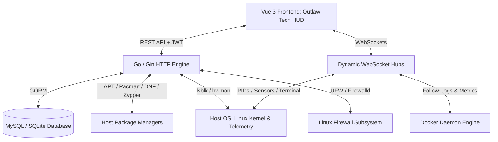

# Blackwater Server Manager

<p align="center">
  
</p>

<p align="center">
  <strong>Robust, High-Performance Linux Server Infrastructure & Telemetry Engine</strong><br>
  <em>Forged with Go, Gin, and Vue 3 — Inspired by the iconic aesthetic of Red Dead Redemption.</em>
</p>

<p align="center">
  
  
  
  
  
  
</p>

---

## 📖 Overview

Named after the pivotal frontier town in *Red Dead Redemption* (RDR1 & RDR2), **Blackwater** is a modern, unified server administration suite built from the ground up for speed, reliability, and precision telemetry.

Combining a lightweight **Go (Gin)** backend with a high-contrast **Outlaw Tech** frontend (featuring charcoal leather, deep crimson, warm amber, and industrial brass telemetry), Blackwater provides complete command over low-level Linux hardware sensors, multi-distro package managers, firewalls, Docker fleets, system processes, and interactive shell terminals.

---

## 🚀 Key Features

### 🖥️ Real-Time Telemetry & Hardware HUD
- **Live CPU & Temperature HUD:** Real-time load meters, core counts, and high-frequency live CPU temperature streaming via WebSockets (`/ws/cpu-temperature`) directly from Linux hardware sensors (`/sys/class/hwmon`).
- **Physical Disk & Partition Diagnostics:** Hardware drive identification via `lsblk` and `gopsutil`, partition mount detection (`boot`, `root`, `home`, external drives), and per-disk temperature monitoring.
- **Signal Flow (Dynamic Network Throughput):** High-precision background sampler that calculates actual per-second upload and download throughput ($\Delta \text{Bytes}/\Delta t$) with dynamic auto-scaling units (`B/s`, `KB/s`, `MB/s`, `GB/s`), total lifetime transferred bytes, and bidirectional LTR/RTL formatting.
- **Historical Performance Reports:** Multi-range historical graphing for CPU, Memory, and Disk metrics with automated usage averages.

### 📦 Multi-Distro Package Management
- **Universal Package Dashboard:** Detects and inspects system package managers across diverse Linux families:
  - **APT** (Debian, Ubuntu, Linux Mint)
  - **Pacman** (Arch Linux, Manjaro, EndeavourOS)
  - **DNF** (Fedora, RHEL, CentOS Stream, Rocky Linux, AlmaLinux)
  - **Zypper** (openSUSE, SUSE Linux Enterprise)
  - **APK** (Alpine Linux)
  - **Snap** & **Flatpak** (Universal Sandboxed Formats)
- **Updates & Package Inspection:** Query installed packages, search repositories, and track pending security and system updates directly through the API and dashboard.

### 🛡️ Multi-Distro Firewall Engine
- **Cross-Platform Firewall Automation:** Seamless compatibility across:
  - **UFW** on Debian, Ubuntu, and Arch Linux
  - **Firewalld** on Red Hat, Fedora, CentOS, Rocky, and AlmaLinux
- **Rule Management:** Enable or disable firewall services, view numbered rule tables, and safely inspect active port filters.

### 🐳 Docker Container Fleet & Auto-Healing
- **Auto-Discovery & Sync:** Background daemon automatically identifies, persists, and synchronizes running host containers every 10 seconds.
- **Resource Monitoring & Live Log Streaming:** Real-time CPU, RAM, Network I/O, Block I/O, and bidirectional log streaming (`WS /ws/docker/:id/logs`) with zero latency.
- **Automated Health & Recovery:** Enforce resource thresholds (CPU/RAM limits) and automated policies (Restart, Start, Stop) when containers stall or exceed quotas.
- **Volume & Storage Diagnostics:** Inspect host-to-container mount mappings and forcefully prune dormant containers and volumes.
- **Multi-Channel Alerts:** Instant container notifications via **Telegram**, **Discord**, or **Custom Webhooks**.

### 💻 Interactive System Terminal
- **Bidirectional Web Terminal:** Integrated browser-based shell powered by WebSockets (`WS /ws/terminal`), allowing administrative host access with full PTY terminal emulation.

### 📁 Advanced File Manager
- **Server File Explorer:** Deep exploration of host directories with permission bits (mode), file sizes, hidden file toggle, and quick directory breadcrumbs.

### 📜 Auditing & Automated Maintenance
- **System Audit Logging:** Records administrative actions (firewall toggles, terminal commands, process management) with user attribution and timestamping.
- **Payload Inspector Modal:** Glassmorphic modal that auto-detects and formats JSON action payloads and execution results for complete observability.
- **Scheduled Retention Pruning:** Configurable background cron job that purges outdated audit logs according to retention periods (minutes to years) to keep databases fast and lean.

### 🔐 Security & Identity
- **Two-Factor Authentication (OTP):** Optional or mandatory 2FA with time-based verification codes.
- **Email Verification:** Identity verification during user registration with security grace periods.
- **Role-Based Access Control (RBAC):** Granular, permission-based authorization engine securing all endpoints and interfaces.

### 🌍 Internationalization & RTL Support
- **Bilingual Interface:** Full localization in **English** and **Arabic**, with layout reversal (LTR / RTL), persistent preferences, and isolated number/unit rendering.

---

## 🛠️ Architecture & Tech Stack



- **Backend:** Go 1.24+, [Gin Web Framework](https://github.com/gin-gonic/gin), [Gorilla WebSocket](https://github.com/gorilla/websocket), [GORM](https://gorm.io/), [gopsutil](https://github.com/shirou/gopsutil).
- **Frontend:** Vue 3 (Composition API), Vite, Pinia, Vue Router, Vue I18n, Lucide Icons, Canvas & SVG Gauges.
- **Typography:** Cinzel, Inter, JetBrains Mono.
- **Databases:** MySQL and SQLite (zero-config, ideal for resource-constrained or edge servers).

---

## 📋 Prerequisites

Ensure you have the following installed on your host:

- **Go:** 1.24 or higher
- **Node.js & npm:** Node 18+ (for frontend development/builds)
- **Database:** MySQL 8+ or SQLite 3
- **OS:** Linux (recommended for hardware telemetry, firewalls, and PTY terminals). *Docker compose mode is available for local testing on macOS and Windows.*

---

## ⚙️ Installation & Setup

### 1. Clone Repository
```bash
git clone https://github.com/ahmedfargh/server-manager.git
cd black-water-server-manager
```

### 2. Backend Setup
Install Go modules:
```bash
go mod tidy
```

Configure your environment file:
```bash
cp .env.example .env
```

Edit `.env` to configure your database driver:

- **For MySQL:**
  ```env
  DB_DRIVER=mysql
  DB_HOST=127.0.0.1
  DB_PORT=3306
  DB_NAME=blackwater
  DB_USER=root
  DB_PASSWORD=your_secure_password
  ```

- **For SQLite (Zero-Config, Recommended for Low-End Servers):**
  ```env
  DB_DRIVER=sqlite
  DB_NAME=blackwater.db
  ```

Compile and run the server:
```bash
go run main.go
# or compile a production binary:
go build -o blackwater main.go
./blackwater
```

The backend server runs on `http://localhost:8080` by default.

---

### 3. Frontend Setup
Navigate to the `frontend` directory:
```bash
cd frontend
npm install
```

Start the Vite development server:
```bash
npm run dev
```
The dashboard interface will be accessible at `http://localhost:5173`.

To generate an optimized production bundle:
```bash
npm run build
```

---

## 🐳 Docker Deployment (Zero-Config)

You can launch Blackwater with Docker Compose for immediate evaluation:

```bash
docker compose up --build -d
```
Access the application at `http://localhost:8080`.

> [!TIP]
> While Docker Compose allows testing the API, database, and web interface on macOS and Windows, full low-level hardware diagnostics, firewall controls, and terminal PTY features require a native Linux host.

---

## 🔗 Key API Endpoints

### 🔐 Authentication & Accounts
| Method | Endpoint | Description |
| :--- | :--- | :--- |
| `POST` | `/login` | Authenticate user credentials & initiate 2FA if enabled |
| `POST` | `/register` | Register a new account (triggers email verification) |
| `POST` | `/verify-email` | Verify registration identity via verification token |
| `POST` | `/resend-verification` | Request a fresh email verification code |
| `POST` | `/verify-otp` | Verify Two-Factor Authentication OTP code |
| `POST` | `/resend-otp` | Request a new OTP token |
| `GET`  | `/users/profile/me` | Fetch authenticated user profile and permissions |
| `POST` | `/users/acount/update` | Update user personal credentials & settings |
| `POST` | `/users/users/notifications/settings` | Configure Telegram, Discord, or Webhook alert credentials |

---

### 📊 Hardware & System Telemetry (Auth Required)
| Method | Endpoint | Description |
| :--- | :--- | :--- |
| `GET`  | `/cpu` | CPU model, cores, and live usage statistics |
| `GET`  | `/ram` | Total, used, and free physical & virtual memory |
| `GET`  | `/disk` | Total disk usage, physical device detection (`lsblk`), and mount points |
| `GET`  | `/network` | Instantaneous transfer rates (`sentPerSec`, `recvPerSec`) and lifetime bytes |
| `GET`  | `/network/connections` | Active socket connections mapped to process owners |
| `GET`  | `/report` | Real-time consolidated CPU, Memory, and Disk telemetry snapshot |
| `POST` | `/hardware-report/by-time-range` | Historical metric samples filtered by date range |
| `POST` | `/hardware-report/average-usage-by-time-range` | Computed performance averages over a given window |

---

### 📦 Package Management (Auth Required)
| Method | Endpoint | Description |
| :--- | :--- | :--- |
| `GET`  | `/packages/overview` | Detect host OS and active package managers (APT, Pacman, DNF, etc.) |
| `GET`  | `/packages/:manager/updates` | List available system & security updates for a package manager |
| `GET`  | `/packages/:manager/list` | List installed packages (supports pagination and query filters) |

---

### 🛡️ Firewall Management (Auth Required)
| Method | Endpoint | Description |
| :--- | :--- | :--- |
| `GET`  | `/firewall/status` | Current firewall state (UFW or Firewalld) |
| `GET`  | `/firewall/enable` | Enable system firewall service |
| `GET`  | `/firewall/disable` | Disable system firewall service |
| `GET`  | `/firewall/rules` | Detailed / numbered list of firewall filtering rules |
| `GET`  | `/firewall/list` | Active firewall rules summary |

---

### 🐳 Docker Management (Auth Required)
| Method | Endpoint | Description |
| :--- | :--- | :--- |
| `GET`  | `/docker/containers` | List all discovered containers on host |
| `GET`  | `/docker/container/:id` | Detailed metadata for a specific container |
| `GET`  | `/docker/container/:id/status` | Live CPU %, memory limit, and I/O metrics |
| `POST` | `/docker/container/:id/:action` | Dispatch action: `start`, `stop`, or `restart` |
| `GET`  | `/docker/container/:id/get/volums` | Inspect host-to-container volume & bind mount mappings |
| `GET`  | `/docker/image/:id/prune` | Forcefully purge a container and associated volumes |
| `POST` | `/docker/container` | Register a new managed container entry |
| `PUT`  | `/docker/container/:id` | Update container threshold quotas and automated actions |
| `DELETE`| `/docker/container/:id` | Remove a container management record |

---

### ⚙️ Processes, Terminal & Filesystem (Auth Required)
| Method | Endpoint | Description |
| :--- | :--- | :--- |
| `GET`  | `/info/processes` | List all active processes running on host |
| `GET`  | `/info/process/single/:pid` | Deep inspection of an individual process |
| `POST` | `/info/process/start` | Launch a new background process |
| `DELETE`| `/info/process/kill/:pid` | Terminate a running process |
| `GET`  | `/filesystem/browse` | Browse directories with permissions & file sizes (`?path=/...`) |
| `GET`  | `/audit/list` | Filter and paginate security audit trails (`?page=&limit=&type=`) |

---

### ⚡ WebSocket Hubs
| Protocol | Endpoint | Description |
| :--- | :--- | :--- |
| `WS` | `/ws/cpu-temperature` | Broadcasts live CPU package temperature every 1s |
| `WS` | `/ws/processes` | Streams running process updates every 5s |
| `WS` | `/ws/docker/:containerId` | Live metrics stream for an individual container |
| `WS` | `/ws/docker/:containerId/logs` | Real-time follow log stream from Docker daemon |
| `WS` | `/ws/terminal` | Bidirectional PTY shell connection for interactive commands |

---

## 🛡️ Permissions Matrix

| Permission | Description |
| :--- | :--- |
| `create_user` / `read_user` | Create and view administrative user accounts |
| `update_user` / `delete_user` | Edit user credentials or revoke access |
| `manage_roles` / `manage_permissions` | Configure access control rules and role assignments |
| `read_processes` / `read_process` | Inspect active system process tables |
| `start_process` / `kill_process` | Spawn new binaries or terminate running processes |
| `read_process_log` | Audit history of started host processes |
| `read_cpu` / `read_gpu` / `read_ram` | Access CPU, GPU, and memory telemetry |
| `read_disk` / `read_network` | Inspect disk storage arrays and network throughput |
| `view_firewall_status` | Check firewall status (UFW or Firewalld) |
| `enable_firewall` / `disable_firewall` | Enable or shut down the host firewall |
| `view_firewall_rules` / `view_firewall_list` | Inspect active firewall port and subnet rules |
| `read_containers` / `manage_containers` | Monitor Docker fleet and trigger lifecycle actions |
| `read_packages` | Inspect installed packages, package managers, and updates |
| `view_audit_logs` | View and inspect security audit trail entries |
| `browse_filesystem` | Explore host filesystem directories and files |
| `site_create` / `site_read` | Configure and monitor external web service endpoints |

---

## 💻 Companion CLI (`bwcli`)

Blackwater includes a native command-line utility for local server management:

```bash
# Build the CLI tool
go build -o bwcli ./cmd/cli

# Display help and available subcommands
./bwcli --help
```

---

## 🤝 Contributing

Contributions, bug reports, and suggestions are welcome!

1. Fork the repository
2. Create your feature branch (`git checkout -b feature/outlaw-enhancement`)
3. Commit your changes (`git commit -m 'Add outlaw enhancement'`)
4. Push to the branch (`git push origin feature/outlaw-enhancement`)
5. Open a Pull Request

---

## 📄 License

Distributed under the MIT License. See `LICENSE` for more information.

---

<p align="center">
  Crafted by <a href="https://github.com/ahmedfargh">Ahmed Farghly</a>
</p>
